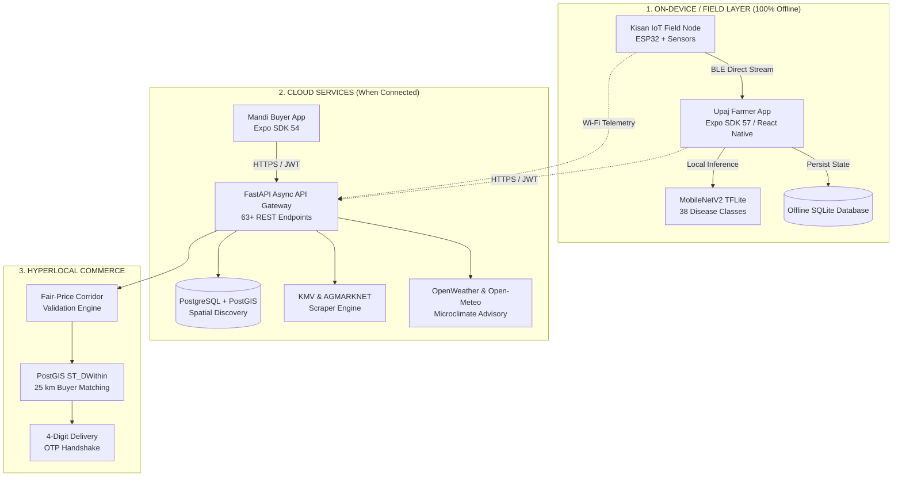

# KisanShakti · ಕಿಸಾನ್‌ಶಕ್ತಿ
### An Integrated Smart Farming & Hyperlocal Commerce Platform for Smallholder Farmers

[](https://vtu.ac.in/)
[](https://xlescience.org/index.php/NIJASET/article/view/2024/959)
[](https://kisanshakti-ai.vercel.app)
[](./LICENSE)
[](./backend/)
[](./apps/)
[](./hardware/)

> **KisanShakti** is an end-to-end agritech and rural commerce ecosystem designed, field-evaluated, and architected for real-time field deployments in Karnataka, India. Created as a **VTU (Visvesvaraya Technological University) Capstone Project** by the Department of Computer Science & Engineering at **C Byregowda Institute of Technology (CBIT), Kolar**, under the mentorship of **Dr. Vasudeva R.**
>
> Published in the *NCERC International Journal of Advanced Science, Engineering and Technology (NIJASET)*, Vol. 6, No. 1, 2026.
>
> **Live Web Launchpad & Showcase**: [https://kisanshakti-ai.vercel.app](https://kisanshakti-ai.vercel.app)

---

## 📑 Table of Contents

1. [Executive Summary & Vision](#-executive-summary--vision)
2. [Ground-Level Problem Statement (Kolar Field Studies)](#-ground-level-problem-statement-collected-from-the-fields)
3. [The KisanShakti Solution: Four Core Pillars](#-the-kisanshakti-solution-four-core-pillars)
4. [Participatory Design & Farmer Evaluation](#-participatory-design--farmer-evaluation)
5. [The Kisan IoT Field Kit](#-the-kisan-iot-field-kit)
6. [Deep-Dive: Upaj (Farmer App)](#-upaj--the-farmer-app-appsupaj)
7. [Deep-Dive: Mandi (Buyer App)](#-mandi--the-buyer--merchant-app-appsmandi)
8. [Launch Platform & Web Hub](#-launch-platform--web-hub-kisanshakti-ai)
9. [System Architecture & Backend Engine](#-system-architecture--backend-engine)
10. [Field Deployment Roadmap & Expected Outcomes](#-field-deployment-roadmap--expected-outcomes-kolar-district-clusters)
11. [Repository Layout](#-repository-layout)
12. [Quick Start & Developer Setup](#-quick-start--developer-setup)
13. [Academic Citation & Research Publication](#-academic-citation--research-publication)
14. [Project Team & Acknowledgments](#-project-team--acknowledgments)

---

## 🌾 Executive Summary & Vision

Smallholder farmers (cultivating < 2 hectares) account for over 85% of India’s agricultural holdings and produce roughly 50% of the nation's food grain. Yet, they face systemic vulnerabilities: predatory intermediary cartels capturing 60–70% of crop value, crop losses of 20–40% caused by delayed disease intervention, non-existent microclimate visibility, and a total absence of digitized farm accounting.

**KisanShakti** breaks these cycles with a unified, offline-first digital architecture spanning:
* **Edge-AI Disease Diagnosis**: Sub-2-second on-device plant pathology without internet connectivity.
* **Low-Cost Kisan IoT Telemetry**: A sub-₹1,000–₹1,500 solar-assisted ESP32 microclimate sensor node communicating over BLE and Wi-Fi.
* **Hyperlocal 25 km Mandi Commerce**: Direct farmer-to-retailer commerce eliminating middlemen via fair-price benchmarking (±5% AGMARKNET/KMV corridor).
* **Farm Business Intelligence (Generational Ledger)**: Unit-economics tracking, ROI calculation per plot, and integrated crop-livestock management.

---

## 🔍 Ground-Level Problem Statement (Collected from the Fields)

During on-ground ethnographic surveys and field interviews conducted across farming villages in **Kolar District, Karnataka** (including Srinivaspur, Bangarpet, Mulbagal, Malur, and Kolar taluks), our team documented four structural breaks crippling smallholder livelihoods:

```
┌─────────────────────────────────────────────────────────────────────────────────┐
│                    THE FOUR STRUCTURAL BREAKS IN INDIAN FARMING                 │
├───────────────────┬───────────────────┬───────────────────┬─────────────────────┤
│   BREAK 01        │   BREAK 02        │   BREAK 03        │   BREAK 04          │
│ Predatory Supply  │ Delayed Disease   │ Micro-Climate     │ Zero Financial      │
│ Chains (60-70%)   │ Diagnosis (20-40%)│ Blind Spots       │ Memory & Accounting │
├───────────────────┼───────────────────┼───────────────────┼─────────────────────┤
│ 3-4 middlemen     │ Extension agents  │ Commercial IoT is │ No ledger; loans    │
│ tiers; arbitrary  │ districts away;   │ costly (>₹15,000);│ from moneylenders;  │
│ commission cuts & │ misdiagnosed leaf │ requires cloud/   │ crop & livestock    │
│ APMC mandi cartels│ blight & pests    │ SIM subscriptions │ unlinked            │
└───────────────────┴───────────────────┴───────────────────┴─────────────────────┘
```

### 1. Break 01: Predatory Supply Chains & Middleman Margin Capture (60–70%)
* In conventional APMC mandis, smallholders are forced to sell through commission agents (*dalals*), loaders, and village collectors.
* Intermediaries absorb between **60% and 70%** of the consumer rupee.
* Smallholder producers bring perishables (e.g., tomatoes in Kolar) and must take whatever price is offered on the day of harvest due to high distress-sale pressure, lack of local cold storage, and non-transparent auctions.

### 2. Break 02: Delayed and Inaccessible Disease Diagnosis (20–40% Crop Loss)
* Agronomic extension officers and university specialists are often located far from village clusters.
* By the time symptoms are identified, fungal or bacterial infections (e.g., Early Blight, Late Blight, Leaf Mold) cause irreversible damage, claiming **20% to 40%** of seasonal yields.
* Farmers rely on input chemical shops for diagnostics, leading to overtreatment, soil degradation, and high input costs.
* Existing AI solutions fail in the field because rural farm plots experience persistent cellular dead-zones where cloud-based vision APIs cannot function.

### 3. Break 03: Microclimate Blind Spots & Prohibitive Telemetry
* Commercial agritech weather stations and soil sensors cost upwards of ₹15,000 to ₹40,000, requiring recurring GSM SIM card data subscriptions.
* Smallholders cannot justify these operational costs. Consequently, irrigation timing, fungal spore risk, and chemical spray windows are determined by guesswork.

### 4. Break 04: Zero Financial Memory & Fragmented Mixed Farming
* Over 80% of smallholders run **Integrated Farming Systems (IFS)** — pairing vegetable or grain farming with milch cattle (HF Cross, Jersey, Malnad Gidda).
* Existing apps either track crops or dairy, but never both.
* Farmers lack structured financial recordkeeping. Costs for fertilizer, pesticide, seeds, tractor rental, and cattle feed are lost, preventing farmers from calculating their true Return on Investment (ROI) or accessing formal institutional credit.
* **App Fatigue**: Juggling separate apps for weather, mandi prices, accounting, and disease detection causes farmers to abandon digital tools altogether.

---

## 🚀 The KisanShakti Solution: Four Core Pillars

KisanShakti integrates the complete crop-to-market cycle into one unified, offline-capable platform:

```
                            ┌────────────────────────────────────────┐
                            │        KISANSHAKTI ECOSYSTEM           │
                            └────────────────────┬───────────────────┘
                                                 │
         ┌───────────────────────┬───────────────┴───────────────┬───────────────────────┐
         ▼                       ▼                               ▼                       ▼
  ┌──────────────┐        ┌──────────────┐                ┌──────────────┐        ┌──────────────┐
  │  PILLAR 01   │        │  PILLAR 02   │                │  PILLAR 03   │        │  PILLAR 04   │
  │  Disease AI  │        │IoT Telemetry │                │Mandi Commerce│        │ Farm Ledger  │
  └──────┬───────┘        └──────┬───────┘                └──────┬───────┘        └──────┬───────┘
         │                       │                               │                       │
  • On-device TFLite      • ESP32 solar node              • 25 km radius match    • Per-plot cycle P&L
  • < 2s offline scan     • Capacitive soil moisture      • Direct farmer-buyer   • Itemized input costs
  • 38 disease classes    • DHT22 canopy climate          • ±5% fair price gate   • Crop ROI calculation
  • ICAR/UAS remedies     • BLE sync (Zero SIM fee)       • 4-digit OTP handshake • Dairy/livestock logs
```

1. **Pillar 01 · Disease AI (Edge Intelligence)**:
   Quantized MobileNetV2 deep learning model running directly on low-cost Android smartphones via TensorFlow Lite. Delivers verified agronomic diagnoses in under 2 seconds completely offline, paired with ICAR (Indian Council of Agricultural Research) and UAS-Bangalore approved chemical and organic treatments.

2. **Pillar 02 · IoT Telemetry (Resilient Sensing)**:
   A self-built, solar-assisted ESP32 microclimate sensor node with an ultra-low Bill of Materials (< ₹1,500). Reads soil moisture, temperature, humidity, and rainfall. Transmits data locally via Bluetooth Low Energy (BLE) directly to the phone when the farmer walks the field, and syncs over Wi-Fi when available—no recurring cellular SIM subscription required.

3. **Pillar 03 · Mandi Commerce (Hyperlocal Exchange)**:
   A spatial 25 km radius matching engine (powered by PostGIS `ST_DWithin`) connecting smallholders directly to local kirana stores, restaurants, supermarkets, and residential buyer groups. Features a government-benchmarked fair-price corridor (±5% AGMARKNET/KMV) to ensure farmers are never underbid, backed by an OTP-verified delivery handshake.

4. **Pillar 04 · Farm Ledger (Generational Business Intelligence)**:
   A local-first financial ledger structuring every plot by crop cycle, sowing month, and year. Computes true Return on Investment (ROI), tracks itemized operational expenditures (seeds, fertilizer, labor), and natively incorporates dairy milk yields to quantify the real unit economics of Integrated Farming Systems.

---

## 👥 Participatory Design & Farmer Evaluation

KisanShakti was built following a **Human-Centered Participatory Agritech Design** methodology:

1. **Focus Groups with Smallholder Communities**:
   * Prior to writing code, UI prototypes were tested in village focus groups across Kolar.
   * Feedback revealed that farmers struggle with English-heavy interfaces, complex drop-down trees, and multi-step forms.
2. **Key Design Innovations Incorporated**:
   * **Bilingual Kannada-First Interface**: Full Kannada vernacular localization ("Namaskara", "ಬೆಳೆ ವಿವರ", "ಮಾರುಕಟ್ಟೆ ದರ") alongside English.
   * **Visual & Audio-Forward Status Cues**: High-contrast, color-coded health indicators (Green = Healthy, Yellow = Action Required, Red = Critical) for immediate comprehension regardless of literacy level.
   * **Local-First Offline SQLite Architecture**: All plot ledgers, recent mandi prices, and sensor readings persist locally in SQLite on the phone so the app remains responsive in the middle of agricultural fields.
   * **Pre-validation Before Backend Integration**: Farmer feedback on wireframes directly defined our API specifications and data contracts before the FastAPI backend was linked.

---

## 🛠️ The Kisan IoT Field Kit

Designed around **zero recurring subscription costs**, the Kisan IoT field node enables root-zone precision irrigation without costly telecommunications hardware.

```
                           +-------------------------+
                           |  Solar Panel (5V / 1W)  |
                           +------------+------------+
                                        |
                           +------------v------------+
                           |  TP4056 + 18650 Li-Ion  |
                           +------------+------------+
                                        |
                           +------------v------------+
                           |     ESP32-WROOM-32      |
                           +---+--------+--------+---+
                               |        |        |
        +----------------------+        |        +----------------------+
        |                               |                               |
        v                               v                               v
+---------------+               +---------------+               +---------------+
| Capacitive    |               | DHT22 Canopy  |               | LM393 Rain    |
| Soil Moisture |               | Temp/Humidity |               | Drop Sensor   |
| (GPIO 35)     |               | (GPIO 4)      |               | (GPIO 34)     |
+---------------+               +---------------+               +---------------+
```

### Bill of Materials (BOM) — Target < ₹1,000–₹1,500
| Component | Specification | Function | Approx Cost (INR) |
|---|---|---|---|
| **Microcontroller** | ESP32-WROOM-32 Dev Module | Core processing, BLE 4.2 & Wi-Fi telemetry | ₹350 |
| **Soil Moisture** | Capacitive Soil Moisture v1.2 (Corrosion-resistant) | Root-zone moisture measurement (GPIO 35) | ₹120 |
| **Air Climate** | DHT22 (AM2302) High Precision | Canopy temperature and relative humidity (GPIO 4) | ₹150 |
| **Precipitation** | LM393 Rain Drop Sensor | Real-time rainfall detection (GPIO 34) | ₹80 |
| **Power Management** | TP4056 Module + 3.7V 2000mAh 18650 Cell | Solar charging and autonomous battery power | ₹200 |
| **Enclosure** | IP65 Weatherproof Junction Box + 3D Mount | Field protection from moisture and dust | ₹100 |
| **Total BOM** | — | — | **~₹1,000** |

### Dual Communication Modes
* **BLE Direct Sync (Offline in Field)**: When the farmer inspects their field, the Upaj app automatically discovers `KisanShakti-ESP32` over BLE. Live readings refresh every 5 seconds without internet or mobile data.
* **Wi-Fi Cloud Stream**: When installed near a farmhouse or mobile hotspot, the ESP32 securely POSTs readings every 5 minutes to `/api/v1/sensor/reading` using hardware token authentication.

---

## 📱 Deep-Dive: Upaj — The Farmer App (`apps/upaj/`)

Built with React Native and Expo (SDK 57 / React Native 0.86), **Upaj** ("Yield") serves as the farmer's daily operational co-pilot.

```
┌────────────────────────────────────────────────────────────────────────┐
│                        UPAJ FARMER APPLICATION                         │
├──────────────┬──────────────┬──────────────┬─────────────┬─────────────┤
│  HOME TAB    │  DISEASE TAB │  MARKET TAB  │ WEATHER TAB │ LEDGER TAB  │
├──────────────┼──────────────┼──────────────┼─────────────┼─────────────┤
│ • KMV Prices │ • On-Device  │ • One-Tap    │ • Live BLE  │ • Per-Plot  │
│ • Weather    │   TFLite AI  │   Crop Sale  │   Sensor    │   P&L Cycle │
│ • Irrigation │ • Organic &  │ • Direct     │ • 7-Day     │ • Dairy/Milk│
│ • Schemes    │   Chemical   │   Buyer Bids │   Forecast  │   Tracking  │
│ • News Feed  │ • Agro-Store │ • OTP Hand-  │ • Spraying  │ • ROI & Unit│
│              │   Locator    │   shake Deal │   Window    │   Economics │
└──────────────┴──────────────┴──────────────┴─────────────┴─────────────┘
```

### 1. Home Dashboard & Vernacular Personalization
* **Bilingual Greeting**: Welcomes the farmer with localized greetings (e.g., "Namaskara, Ramappa") in Kannada or English.
* **Live APMC Mandi Ticker**: Displays today's live wholesale prices for key local crops (Tomato, Potato, Onion, Ragi, Cabbage, Chilli) sourced directly from Karnataka's Krishi Marata Vahini (KMV) and AGMARKNET.
* **Instant Irrigation Advisory**: Calculates daily crop water requirements based on real-time soil moisture and evapotranspiration data.
* **Karnataka Government Schemes**: Integrated tracker for schemes including PM-KISAN, Raitha Siri, Krishi Bhagya, and drip irrigation subsidies.

### 2. Edge-AI Crop Disease Diagnosis
* **100% Offline Inference**: Executes a quantized MobileNetV2 model locally via `react-native-fast-tflite`. Diagnostics complete in `< 2.0 seconds` without sending photos to cloud servers.
* **Green Dominance & Leaf Verification Gate**: Algorithms evaluate whether the captured image contains sufficient plant foliage before inference to prevent invalid scans.
* **55% Safety Threshold**: Guarantees that uncertain diagnoses trigger an advisory warning rather than recommending incorrect agrochemicals.
* **Actionable Treatment Plans**:
  * **Organic Treatment**: Neem oil formulations, Trichoderma viride biological controls, and cultural practices.
  * **Chemical Treatment**: Precise dosages (e.g., Mancozeb 75% WP @ 2.5 g/L) to prevent chemical overuse.
  * **Hyperlocal Agrochemical Locator**: Calculates distance to the nearest verified input supplier (e.g., "Raju Agro Center, 2.3 km away").

### 3. Hyperlocal Direct Marketplace Listing
* **Instant Produce Listing**: Farmers upload crop photos, specify harvest date, available quantity (kg/quintals), and target price.
* **Fair Price Corridor Engine**: Compares requested prices against real-time APMC mandi benchmarks to prevent farmer undercutting.
* **Offer Management**: Farmers view incoming bids from local buyers within 25 km, with one-tap Accept, Counter, or Decline options.
* **4-Digit Delivery OTP Handshake**: Secure transaction verification; buyers provide an OTP upon physical delivery to complete the sale.

### 4. Live Sensor Telemetry & Weather Forecast
* **BLE Auto-Pairing Wizard**: Discovers nearby field nodes with zero technical configuration.
* **Live Sensor Dashboard**: Real-time gauges for soil moisture %, ambient temperature (°C), relative humidity (%), and rain intensity.
* **3-Hour Spray Window Calculation**: Analyzes wind speed, precipitation probability, and leaf wetness to identify optimal chemical application windows.

### 5. Farm Business Intelligence & Integrated Livestock Ledger
* **Per-Plot Accounting**: Tracks costs across individual plots (Plot A: Tomato, Plot B: Ragi).
* **Itemized Expense Categorization**: Tracks seed costs, land preparation, fertilizers, pesticides, labor, and harvesting fees.
* **Automatic Sales Sync**: Completed marketplace deals automatically post to the plot's revenue ledger, computing net profit and exact ROI (e.g., "Tomato Season 2: 154% ROI").
* **Integrated Livestock Tracking**: Profiles dairy cattle (HF Cross, Malnad Gidda), daily milk yield logs, and vaccination reminders.

---

## 🛒 Deep-Dive: Mandi — The Buyer App (`apps/mandi/`)

Designed for rural and semi-urban procurement—including kirana shops, wholesale aggregators, local restaurants, supermarkets, and consumer cooperatives.

```
┌────────────────────────────────────────────────────────────────────────┐
│                        MANDI BUYER APPLICATION                         │
├──────────────┬──────────────────────────────┬──────────────────────────┤
│ DISCOVERY    │ BIDDING & NEGOTIATION        │ FULFILLMENT & TRUST      │
├──────────────┼──────────────────────────────┼──────────────────────────┤
│ • 25 km      │ • Transparent Offer Engine   │ • 4-Digit OTP Handoff    │
│   Geofencing │ • Fair-Price Corridor Check  │ • Plot Traceability      │
│ • Live KMV   │ • Counter-Offer Negotiation  │ • Digital Invoices       │
│   Benchmarks │ • Sibling Offer Auto-Reject  │ • Farmer Ratings         │
└──────────────┴──────────────────────────────┴──────────────────────────┘
```

* **Hyperlocal Geofenced Produce Feed**: Displays available farmgate harvests within 25 km using PostGIS distance calculations.
* **Transparent Price Benchmarking**: Compares the farmer's asking price directly against the nearest APMC mandi modal price.
* **Direct Bidding Engine**: Buyers make direct offers per kg. When a farmer accepts an offer, competing bids are automatically reconciled.
* **Farmgate Traceability**: Buyers inspect plot details, harvest date, and crop images prior to bidding.
* **Delivery Confirmation via OTP**: Eliminates payment disputes through cryptographic OTP-based delivery handshakes.

---

## 🌐 Launch Platform & Web Hub (kisanshakti-ai)

Our live web platform hosted at **[https://kisanshakti-ai.vercel.app](https://kisanshakti-ai.vercel.app)** serves as the central hub for the KisanShakti ecosystem:

```
┌────────────────────────────────────────────────────────────────────────┐
│            KISANSHAKTI WEB PLATFORM (kisanshakti-ai.vercel.app)        │
├───────────────────┬───────────────────┬────────────────────────────────┤
│ SYSTEM SHOWCASE   │ HARDWARE 3D MODEL │ DOWNLOAD HUB & PAPERS          │
├───────────────────┼───────────────────┼────────────────────────────────┤
│ • Interactive     │ • 360° Interactive│ • Direct Android APK Downloads │
│   Pillars (1-4)   │   Render of IoT   │ • NIJASET Research Article     │
│ • Cloud & Edge    │   Sensor Node     │ • Academic Guide & Team        │
│   Architecture    │ • Component Specs │ • Pilot Cluster Information    │
└───────────────────┴───────────────────┴────────────────────────────────┘
```

### Key Highlights of the Web Hub:
* **Interactive Architecture Explorer**: Visualizes the flow between on-device offline layers, cloud APIs, and hardware telemetry.
* **3D Hardware CAD Showcase**: Interactive 360° visualization of the solar-topped Kisan IoT field enclosure and sensor array.
* **Direct Mobile APK Downloads**:
  * [Download Upaj Farmer APK](https://github.com/Bhanucreator/KisanShakti-Portfolio/releases/download/v1.0.0/Upaj.apk)
  * [Download Mandi Buyer APK](https://github.com/Bhanucreator/KisanShakti-Portfolio/releases/download/v1.0.0/Mandi.apk)
* **Research Paper Repository**: Direct links to our published academic literature and datasets.

---

## 🏗️ System Architecture & Backend Engine



### Backend Specifications (`backend/`)
* **Framework**: FastAPI (Python 3.12) with asynchronous request handling.
* **Database**: SQLAlchemy 2 ORM with SQLite for local development, configured for PostgreSQL with PostGIS in production.
* **Security & Auth**: JWT authentication (HS256) with role-scoped ownership enforcement across all 63 endpoints.
* **Rate Limiting**: Sliding-window rate limiting protecting OTP verification, sensor telemetry writes, and marketplace bidding.
* **Real-Time Market Feeds**: Scrapes Karnataka's Krishi Marata Vahini (KMV) covering all 162 state APMCs with fallback to `data.gov.in` AGMARKNET. Data is cached for 30 minutes with strict data honesty rules (no fabricated numbers).

---

## 📍 Field Deployment Roadmap & Expected Outcomes (Kolar District Clusters)

KisanShakti is specifically designed and calibrated for **Kolar District, Karnataka** — recognized as the vegetable, tomato, and dairy capital of South India. While the mobile prototype interaction models and offline UX have been evaluated with smallholder farmers in field focus groups, **actual full-scale hardware sensor installations and live commercial pilot deployments are currently in the active planning and rollout preparation phase.**

```
       [ Srinivasapur ] ---> Mango / Tomato Belt (Planned Cluster 1)
             |
       [ Kolar Taluk ]  ---> Central APMC Market / Dairy Hub (Planned Cluster 2)
             |
       [ Mulbagal ]     ---> Mixed Crop-Livestock / Ragi (Planned Cluster 3)
             |
       [ Bangarpet ]    ---> Hyperlocal Retail Procurement (Planned Cluster 4)
             |
       [ Malur ]        ---> Polyhouse & High-Value Horticulture (Planned Cluster 5)
```

* **Current Status**: **Open & Prepared for Real-Time Deployments**. Prototypes, firmware, and backend APIs are fully built, tested, and validated for initial cluster rollouts across Kolar smallholder communities.
* **Target Agricultural Produce**: High-perishability crops subject to severe price volatility (Tomatoes, Capsicum, Cabbage, Beans, Ragi) alongside Integrated Farming System (IFS) dairy cattle.
* **Expected Outcomes & Projected Impact (as documented in our NIJASET research)**:
  * **Economic Impact (Intermediary Bypass)**: By connecting farmers directly with local retailers, kirana stores, and consumers within a 25 km radius, the platform is projected to remove the 60–70% margin typically captured by supply-chain middlemen, boosting smallholder net profit margins by an estimated **25% to 40%**.
  * **Agronomic Impact (Early Disease Containment)**: On-device MobileNetV2 diagnostics (< 2 seconds, offline) are projected to curb seasonal crop losses by **20% to 40%** by enabling interventions 4 to 6 days earlier than traditional agricultural extension visits.
  * **Resource & Water Optimization**: Capacitive soil moisture feedback combined with microclimate evapotranspiration calculations is anticipated to reduce irrigation water usage by up to **30% to 45%**, preserving groundwater and electricity.
  * **Financial Visibility**: Establishing a per-plot ledger bridging crop cycles and daily dairy yield to overcome "app fatigue" and build institutional credit readiness for smallholders.

---

## 📂 Repository Layout

```
kisanshakti/
├── apps/
│   ├── upaj/                    # Farmer mobile app (Expo SDK 57 / React Native 0.86)
│   │   ├── src/app/(tabs)/      # Home, Disease, Market, Weather, Ledger tabs
│   │   ├── src/lib/             # BLE manager, TFLite engine, local SQLite
│   │   └── package.json
│   └── mandi/                   # Buyer mobile app (Expo SDK 54 / React Native)
│       ├── src/app/(tabs)/      # Discovery feed, Bidding, Order status
│       └── package.json
├── backend/                     # FastAPI backend application
│   ├── commerce_endpoints.py    # Marketplace listings, bidding, OTP handshake
│   ├── disease_endpoints.py     # Plant pathology models & remedies
│   ├── home_endpoints.py        # KMV/AGMARKNET market prices & weather advisories
│   ├── sensor_endpoints.py      # ESP32 telemetry ingestion & BLE pairing
│   ├── main.py                  # API gateway routing & middleware
│   └── requirements.txt
├── hardware/
│   └── esp32_sensor_node/       # ESP32 Arduino firmware for field sensor
│       ├── esp32_sensor_node.ino
│       └── README.md            # Hardware wiring & flashing guide
├── shared/                      # Shared TypeScript types & validation schemas
├── bgpic/                       # Documentation assets and screenshots
└── README.md                    # Main project documentation
```

---

## ⚡ Quick Start & Developer Setup

### Prerequisites
* **Node.js**: v20+ with npm / npx
* **Python**: v3.12+
* **Android Studio**: For Android Emulator or physical device debugging
* **Arduino IDE 2.x**: (Optional) For flashing ESP32 sensor firmware

### 1. Backend Server Setup
```bash
# Navigate to backend
cd backend

# Create and activate Python virtual environment
python -m venv venv
# On Windows:
venv\Scripts\activate
# On Linux/macOS:
source venv/bin/activate

# Install dependencies
pip install -r requirements.txt

# Configure environment variables
cp .env.example .env

# Launch FastAPI development server
uvicorn main:app --reload --host 0.0.0.0 --port 8000
# OpenAPI interactive Swagger docs: http://localhost:8000/docs
```

### 2. Upaj (Farmer App) Setup
```bash
# Navigate to Upaj app directory
cd apps/upaj

# Install dependencies
npm install

# Point the app to your backend API
# For Android Emulator:
export EXPO_PUBLIC_API_URL=http://10.0.2.2:8000
# For physical device (use local network IP):
export EXPO_PUBLIC_API_URL=http://192.168.x.x:8000

# Start Expo development server
npx expo start --clear
# Press 'a' to open Android emulator or scan QR code via Expo Go
```

### 3. Mandi (Buyer App) Setup
```bash
# Navigate to Mandi app directory
cd apps/mandi

# Install dependencies
npm install

# Point to API and launch
export EXPO_PUBLIC_API_URL=http://10.0.2.2:8000
npx expo start --clear
```

### 4. Flashing the ESP32 Hardware
1. Connect ESP32 Dev Board via USB.
2. Open `hardware/esp32_sensor_node/esp32_sensor_node.ino` in Arduino IDE.
3. Install dependencies from Library Manager: `DHT sensor library` and `ArduinoJson` (v6.x).
4. Select Board: **ESP32 Dev Module**, choose the active COM port, and click **Upload**.

---

## 📚 Academic Citation & Research Publication

This research was conducted as a VTU Capstone Project and published in the peer-reviewed *NCERC International Journal of Advanced Science, Engineering and Technology (NIJASET)*:

```bibtex
@article{kisanshakti2026,
  title   = {KISANSHAKTI: AN INTEGRATED SMART FARMING AND HYPERLOCAL COMMERCE PLATFORM FOR ENHANCING FARMER PROFITABILITY IN INDIA},
  author  = {Bhanu kiran R and Harshitha L and Bindan N and Harshitha N S and Dr. Vasudeva R},
  journal = {NCERC International Journal of Advanced Science, Engineering and Technology (NIJASET)},
  volume  = {6},
  number  = {1},
  pages   = {605--614},
  year    = {2026},
  isbn    = {978-93-5768-920-5},
  url     = {https://xlescience.org/index.php/NIJASET/article/view/2024/959}
}
```

---

## 👨‍💻 Project Team & Acknowledgments

### Project Team (Department of Computer Science & Engineering, CBIT Kolar)
* **Bhanu Kiran R** — ([LinkedIn](https://www.linkedin.com/in/bhanu-kiran-r) · [Email](mailto:bhanukiran90216@gmail.com))
* **Bindan N** — ([LinkedIn](https://www.linkedin.com/in/bindan-n))
* **Harshitha L** — ([LinkedIn](https://www.linkedin.com/in/harshithalakshman))
* **Harshitha N S** — ([LinkedIn](https://www.linkedin.com/in/harshitha-ns-3359a72bb))

### Academic Guidance & Mentorship
* **Dr. Vasudeva R.** — Professor & Head of Department, Department of Computer Science & Engineering, C Byregowda Institute of Technology (CBIT), Kolar. Affiliated to **Visvesvaraya Technological University (VTU)**, Belagavi.

---

<p align="center">
  <b>KisanShakti · Transforming smallholder farmers into resilient rural entrepreneurs.</b><br>
  Built with ❤️ in Kolar, Karnataka, India.
</p>
